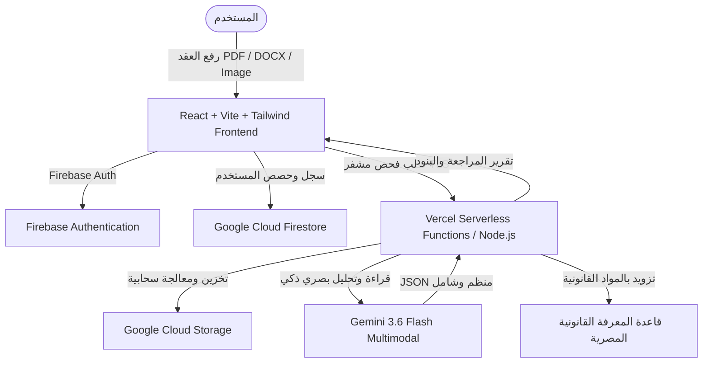

# دليل | Dalil ⚖️🇪🇬
### المساعد القانوني الذكي لفحص العقود والمستندات القانونية

[](https://dalileg.vercel.app/)
[](https://aistudio.google.com/)
[](https://firebase.google.com/)
[](https://cloud.google.com/)
[](https://www.typescriptlang.org/)
[](https://react.dev/)

**دليل (Dalil)** هو منصة مصرية ذكية لفحص ومراجعة العقود والمستندات القانونية. يتيح للمواطن العادي وأصحاب الأعمال فهم بنود العقود المعقدة بلغة مصرية مبسطة ودقيقة، وكشف الثغرات والشروط الجزائية المجحفة، والاستفسار التفاعلي عن أي بند من بنود المستند استناداً للقوانين المصرية (القانون المدني، قانون العمل، قانون حماية المستهلك، وقوانين الإيجار).

---

## 🌟 الرابط المباشر للمنصة
🌐 **[https://dalileg.vercel.app/](https://dalileg.vercel.app/)**

---

## 🚀 التقنيات والخدمات السحابية المستخدمة

### 1. 🤖 Google Gemini API (Gemini 3.6 Flash)
- **تحليل بصري متعدد الوسائط (Multimodal AI):** قراءة وفحص مستندات PDF والصور عالية الدقة (Scanned Documents) وملفات DOCX مباشرة بدقة فائقة.
- **استخراج ذكي للأطراف والبنود:** تحديد أطراف التعاقد، مدة العقد، القيمة المالية، وغرامات التأخير، وتصنيف البنود الحرجة (Critical) وتنبيهات التفاوض (Warning).
- **مساعد قانوني تفاعلي (`/api/ask`):** شات بوت ذكي يجيب عن أي استفسار حول العقد بلهجة مصرية مبسطة مع الاستشهاد بالمواد القانونية ذات الصلة.
- **نظام محرك قانوني محلي هجين (Hybrid Rule Engine):** في حال حدوث أي انقطاع للشبكة، يعمل محرك قانوني محلي مبني خصيصاً للقانون المصري كبديل فوري وسريع.

### 2. 🔥 Firebase (Google Firebase Ecosystem)
- **Firebase Authentication:** إدارة تسجيل وحماية حسابات المستخدمين (بالبريد وكلمة المرور أو عبر Google Sign-in) مع التحقق الأمني من الجلسات.
- **Cloud Firestore:** تخزين بيانات المستخدمين، وإدارة باقات الاشتراك وحصص الاستخدام (Quotas)، وسجل العمليات والمراجعات بشكل سحابي متزامن وفوري.

### 3. ☁️ Google Cloud & Cloud Storage
- **تخزين سحابي آمن (Google Cloud Storage):** إدارة وحفظ مستندات المستخدمين ومعالجة التدفقات الثنائية (Binary Streams) بكفاءة واعتمادية سحابية عالية.
- **معالجة سحابية Serverless:** بيئة تشغيل سحابية مرنة بدون خادم (Serverless Functions) تضمن سرعة استجابة فائقة وتوافقاً مع الحجم المتغير للطلبات على Vercel و Google Cloud.

### 4. 🔒 التشفير وحماية البيانات (Bank-Grade Security & Encryption)
- **تشفير كامل للبيانات (End-to-End Encryption):** جميع البيانات المنقولة بين العميل والخادم مشفرة عبر بروتوكولات **TLS 1.3 / HTTPS**.
- **عزل أمني تام للمفاتيح (Server-Side Isolation):** مفاتيح الذكاء الاصطناعي (Gemini API Key) وخدمات Google Cloud معزولة بالكامل على السيرفر ولا تصل أبداً إلى متصفح العميل، مع دعم التشفير الثنائي للـ Tokens السرية.
- **حماية الخصوصية ومسح المستندات المؤقتة:** لا يتم مشاركة أو تخزين بيانات العقود الحساسة إلا بموافقة المستخدم وبشكل مشفر لمنع أي وصول غير مصرح به.

---

## 📋 المميزات الأساسية للمنصة

1. **فحص العقود الفوري (Instant Contract Audit):**
   - استخراج عنوان العقد، نوعه، أطرافه (المؤجر/المستأجر، البائع/المشتري، صاحب العمل/الموظف)، والمدة، والبدل المالي.
   - تصنيف البنود بألوان واضحة:
     - 🔴 **بنود حرجة (Critical):** شروط تعسفية، غرامات مبالغ فيها، أو بنود تسلب حقوقاً قانونية.
     - 🟡 **بنود تحذيرية (Warning):** بنود تحتاج تفاوضاً وإعادة صياغة.
     - 🟢 **بنود طبيعية (Normal):** بنود قياسية متوازنة.
2. **لغة مصرية شارحة ومبسطة:**
   - شرح كل بند زي ما محامي شاطر بيشرح لواحد صاحبه بدون تعقيد، مع بيان سبب أهمية البند وما يجب فعله.
3. **مساعد "اسأل المستند" (Interactive Document Q&A):**
   - حوار تفاعلي يسأل فيه المستخدم عن أي شيء (مثل: "هل يحق له طردي لو اتأخرت أسبوع؟" أو "مين يدفع فواتير الكهرباء؟").
4. **دعم كافة صيغ المستندات:**
   - ملفات PDF (نصية وممسوحة ضوئياً).
   - الصور (JPG, PNG).
   - ملفات الوورد (DOCX).
5. **نظام إدارة الاشتراكات والحسابات الشخصية:**
   - باقات فحص (تجريبية، باقات استشارية، اشتراكات ممتدة) مع متابعة رصيد المستندات المتبقية.

---

## 🛠️ البنية التقنية (Architecture)



---

## 💻 التشغيل محلياً للمطورين (Local Development)

### المتطلبات الأساسية:
- Node.js (الإصدار 18 أو أحدث)
- مفتاح Gemini API (يمكن الحصول عليه مجاناً من Google AI Studio)
- حساب مشروع Firebase

### خطوات التثبيت والتشغيل:

1. **استنساخ المستودع:**
```bash
git clone https://github.com/moabdelmoati/dalil--.git
cd dalil--
```

2. **تثبيت حزم الواجهة والخادم:**
```bash
cd frontend
npm install
```

3. **إعداد متغيرات البيئة:**
قم بإنشاء ملف `.env` داخل مجلد `frontend`:
```env
# Google Gemini API
GEMINI_API_KEY=your_gemini_api_key_here
GEMINI_MODEL=gemini-3.6-flash

# Firebase Configuration
VITE_FIREBASE_API_KEY=your_firebase_api_key
VITE_FIREBASE_AUTH_DOMAIN=your_project.firebaseapp.com
VITE_FIREBASE_PROJECT_ID=your_project_id
VITE_FIREBASE_STORAGE_BUCKET=your_project.appspot.com
VITE_FIREBASE_MESSAGING_SENDER_ID=your_sender_id
VITE_FIREBASE_APP_ID=your_app_id
```

4. **التشغيل في بيئة التطوير:**
```bash
npm run dev
```
افتح المتصفح على: `http://localhost:5173`

5. **بناء المشروع للإنتاج:**
```bash
npm run build
```

---

## 📡 نقاط النهاية البرمجية (API Endpoints)

| المسار | الطريقة | الوصف |
| :--- | :---: | :--- |
| `/api/analyze` | `POST` | استقبال ملف المستند (Multipart FormData) وإجراء فحص شامل للبنود عبر Gemini والمحرك المحلي. |
| `/api/ask` | `POST` | استعلام تفاعلي مع سياق المحادثة وإجابة أسئلة المستخدم حول المستند. |
| `/api/health` | `GET` | فحص جاهزية الخادم وحالة الاتصال بمحرك الذكاء الاصطناعي. |

---

## ⚖️ إخلاء مسؤولية قانوني (Legal Disclaimer)

منصة **"دليل"** هي أداة ذكاء اصطناعي وتكنولوجيا قانونية (LegalTech) تهدف إلى زيادة الوعي القانوني وتسهيل قراءة العقود وفهمها للمواطن العادي، ولا تُعد بديلاً عن التوكيل أو المشورة القانونية الرسمية الصادرة من محامٍ مقيد بنقابة المحامين في النزاعات القضائية.

---

## 👥 فريق العمل والمساهمة
تم تطوير المنصة بأحدث معايير الأمان والتصميم العربي المتجاوب (RTL-first).
لأي استفسارات أو مقترحات تطوير، يسعدنا تواصلكم عبر المستودع.
